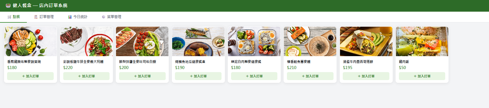
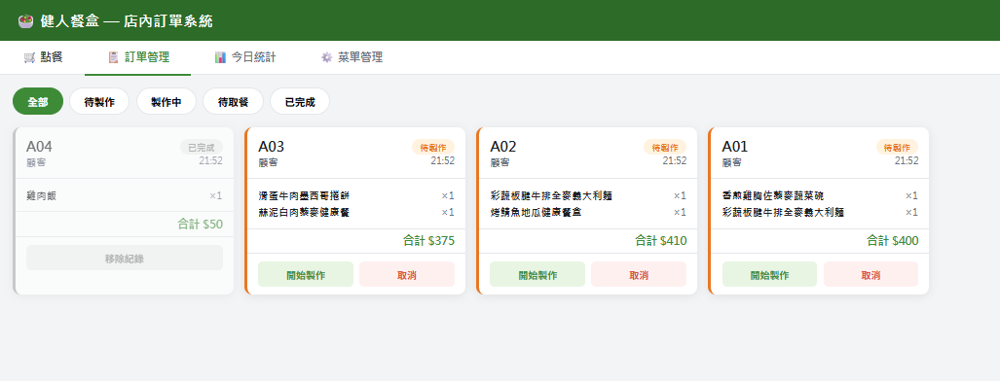
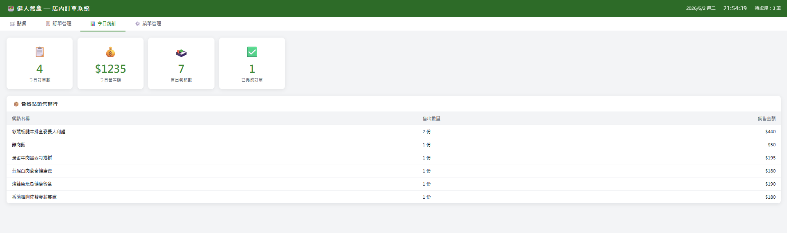
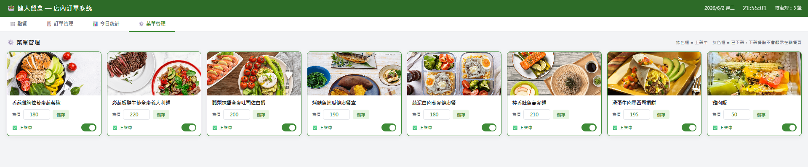

# 健人餐盒｜健康餐點點餐系統

> 簡單易用的內部點餐與訂單管理系統

---

## 畫面預覽

### 點餐頁面


### 訂單管理


### 今日統計


### 菜單管理


---

## 功能介紹

- 🍱 **點餐** — 瀏覽菜單、選擇餐點、送出訂單
- 📋 **訂單管理** — 查看所有訂單、更新訂單狀態
- 📊 **今日統計** — 當日訂單數量與銷售數據
- 🧾 **菜單管理** — 新增、編輯、刪除餐點與圖片上傳

---

## 技術架構

| 層級 | 技術 |
|------|------|
| 前端 | HTML、CSS、JavaScript |
| 後端 | Node.js + Express |
| 資料儲存 | JSON 檔案 |
| 圖片上傳 | Multer |

---

## 快速開始

```bash
git clone https://github.com/Thexushao/healthy-meal-website.git
cd healthy-meal-website
npm install
node server.js
```

開啟瀏覽器前往 [http://localhost:3000/order-system.html](http://localhost:3000/order-system.html)

---

## 資料存放位置

| 資料 | 路徑 |
|------|------|
| 菜單設定 | `data/menu.json` |
| 所有訂單 | `data/orders.json` |
| 上傳圖片 | `uploads/` |

關閉伺服器後資料不會消失，重新啟動會自動讀取。
